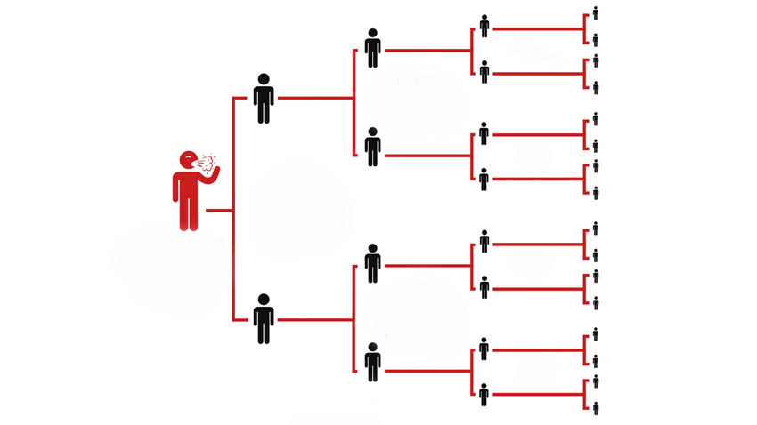
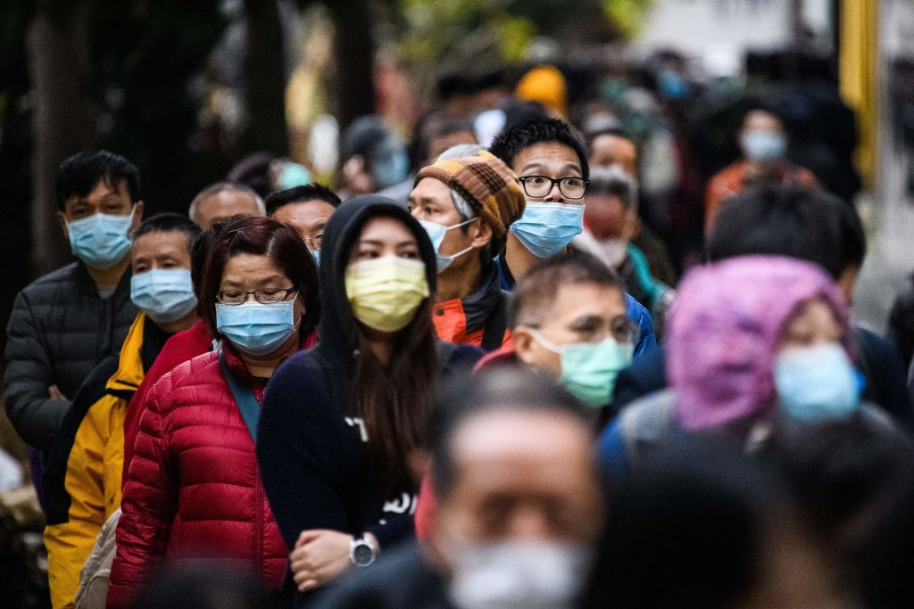

# Social distance detector

> Universidad Católica Boliviana "San Pablo" Regional La Paz Av 14 de Septiembre Nº 4807 esquina, La Paz - Bolivia

---
**Engineers developer team**  
---

Bustillos Vila, Daniel Arturo

Fernandez Testa, Sergio Rodrigo

Molina Montes, Mariana

Quinteros Terrazas, Osvaldo Cesar

 

> Mechatronics Engineering La Paz, Bolivia

## Introduction
COVID-19 belongs to the family of diseases caused by coronavirus, first reported in China in late 2019. China announced its first death from the virus on January 11, 2020, a 61-year-old man. On March 11th,The World Health Organization (WHO) declared this disease a pandemic due to its rapid spread in 114 countries with high mortality and high active cases. Several health organizations, scientists, and doctors tried to develop a vaccine, but until then there was no success.

This forced the world to look for an alternative solution to avoid drastic results. The lockdown was imposed globally and maintaining a safe social distance is reported to be the alternative solution to deal with this drastic situation. The term social distancing is the best idea to minimize the spread of COVID-19. The basic goal is to reduce physical contact between the infected and healthy people. As prescribed by the WHO, people should keep a distance of at least 1 meter from each other to control the spread of this disease.
One idea to monitor social distancing in public places is to use some method of machine vision with security cameras. While this does not help us to force people to maintain adequate social distance, it helps us to plan new security measures.
Since it has been shown that there is a relationship between the spread with respect to the social behavior of people, a place that could require attention is the work sectors with attention to the public, places of supply such as the market or supermarket, or places of entertainment such as the beach or cinemas.

## Problem statement

Currently, a very complicated situation that has been affecting the world population since the end of the year 2019 is the coronavirus. The coronavirus has changed the way of life of the entire population and has forced us to take certain measures to avoid contagion. Among the measures that one should consider to avoid catching the virus is social distancing, because the virus is spread among people and through the air. Today, in the year 2021, we are facing an even worse threat than in past years, due to a resurgence and mutation of the virus in countries such as India, England and Brazil. However, biosecurity measures remain the same as they were with the first strain, including the use of a chapstick, avoidance of enclosed and/or crowded spaces and social distancing. Consequently, this project has application in public places, since it allows us to determine how many people in an established area are complying with biosecurity measures. +drama
The team is going to use Coco dataset in order to train the model efficiently and in this way solve this problem. Coco is a dataset that has labeled images of people, cars, trucks, airplanes, animals, etc. In a punctual way, The following data can be found
- Whether the object is in the image or not.
- The size that is required for the detection box
- To which class it belongs, in this case we are interested in the class "people".
The team expects to use this data to be able to alert when people are too close together and in this way, reduce contagion. Development of the algorithm logic is based on numerical values indicating how many people in the image would be breaching the social distance. 
Finally, a test set will be prepared with a prudent number of images that will give us as a result significant metrics, being the evaluation metrics used:
- Accuracy
- Confusion matrix 
- Recall

The best way to fight the spread of the virus is to stay at home, nonetheless when this is not possible the best way in which we can take care of ourselves is by social distancing from each other. Everyone has a crucial role to play in slowing the spread and protecting themselves, their family, and their community, protecting all bolivians. In addition to practicing everyday steps to prevent COVID-19 such as, wearing masks, avoiding touching your face with unwashed hands, and frequently washing your hands with soap and water, keeping space between you and others is one of the best tools we have to avoid being exposed to this virus and slowing its spread. 

## Technical Approach

In this section technical methods to approach the problem are described. The team’s solution is based on object detection in real time, several libraries useful for numerical are going to be used. 

The first important library the team is aiming to use is SciPy. Scipy is a Python-based eco-system for science, engineering and mathematics and the SciPy library is one of the core packages that constitute the SciPy software. It provides the team with efficient and easy-use numerical routines, such as routines for numerical integration, interpolation, optimization, linear algebra, and statistics. Main advantage of this library is that it is open-source, the team is going to be using a package called spatial and its function dist. scipy.spatial can compute triangulations, Voronoi diagrams, and convex hulls of a set of points, by leveraging the Qhull library, and more. 
The team is aiming to use the last version of Scipy which is 1.7.0.dev0+1173.d92749a due to the fact that it will be required in order to compute our pairwise distance maps and to define the minimum safe distance (in pixels) that two people can be.

The second library the team is using is NumPy, a fundamental package for scientific computing in Python. Using NumPy means a great advantage cause it provides a multidimensional array object, various derived objects (such as masked arrays and matrices), and an assortment of routines for fast operations on arrays, including mathematical, logical, shape manipulation, sorting, selecting, I/O, discrete Fourier transforms, basic linear algebra, basic statistiIntroduction
COVID-19 belongs to the family of diseases caused by coronavirus, first reported in China in late 2019. China announced its first death from the virus on January 11, 2020, a 61-year-old man. On March 11th,The World Health Organization (WHO) declared this disease a pandemic due to its rapid spread in 114 countries with high mortality and high active cases. Several health organizations, scientists, and doctors tried to develop a vaccine, but until then there was no success.

This forced the world to look for an alternative solution to avoid drastic results. The lockdown was imposed globally and maintaining a safe social distance is reported to be the alternative solution to deal with this drastic situation. The term social distancing is the best idea to minimize the spread of COVID-19. The basic goal is to reduce physical contact between the infected and healthy people. As prescribed by the WHO, people should keep a distance of at least 1 meter from each other to control the spread of this disease.
One idea to monitor social distancing in public places is to use some method of machine vision with security cameras. While this does not help us to force people to maintain adequate social distance, it helps us to plan new security measures.
Since it has been shown that there is a relationship between the spread with respect to the social behavior of people, a place that could require attention is the work sectors with attention to the public, places of supply such as the market or supermarket, or places of entertainment such as the beach or cinemas.
Problem statement
Currently, a very complicated situation that has been affecting the world population since the end of the year 2019 is the coronavirus. The coronavirus has changed the way of life of the entire population and has forced us to take certain measures to avoid contagion. Among the measures that one should consider to avoid catching the virus is social distancing, because the virus is spread among people and through the air. Today, in the year 2021, we are facing an even worse threat than in past years, due to a resurgence and mutation of the virus in countries such as India, England and Brazil. However, biosecurity measures remain the same as they were with the first strain, including the use of a chapstick, avoidance of enclosed and/or crowded spaces and social distancing. Consequently, this project has application in public places, since it allows us to determine how many people in an established area are complying with biosecurity measures. +drama
The team is going to use Coco dataset in order to train the model efficiently and in this way solve this problem. Coco is a dataset that has labeled images of people, cars, trucks, airplanes, animals, etc. In a punctual way, The following data can be found
- Whether the object is in the image or not.
- The size that is required for the detection box
- To which class it belongs, in this case we are interested in the class "people".
The team expects to use this data to be able to alert when people are too close together and in this way, reduce contagion. Development of the algorithm logic is based on numerical values indicating how many people in the image would be breaching the social distance. 
Finally, a test set will be prepared with a prudent number of images that will give us as a result significant metrics, being the evaluation metrics used:
- Accuracy
- Confusion matrix 
- Recall

The best way to fight the spread of the virus is to stay at home, nonetheless when this is not possible the best way in which we can take care of ourselves is by social distancing from each other. Everyone has a crucial role to play in slowing the spread and protecting themselves, their family, and their community, protecting all bolivians. In addition to practicing everyday steps to prevent COVID-19 such as, wearing masks, avoiding touching your face with unwashed hands, and frequently washing your hands with soap and water, keeping space between you and others is one of the best tools we have to avoid being exposed to this virus and slowing its spread. 
Technical Approach
In this section technical methods to approach the problem are described. The team’s solution is based on object detection in real time, several libraries useful for numerical are going to be used. 

The first important library the team is aiming to use is SciPy. Scipy is a Python-based eco-system for science, engineering and mathematics and the SciPy library is one of the core packages that constitute the SciPy software. It provides the team with efficient and easy-use numerical routines, such as routines for numerical integration, interpolation, optimization, linear algebra, and statistics. Main advantage of this library is that it is open-source, the team is going to be using a package called spatial and its function dist. scipy.spatial can compute triangulations, Voronoi diagrams, and convex hulls of a set of points, by leveraging the Qhull library, and more. 
The team is aiming to use the last version of Scipy which is 1.7.0.dev0+1173.d92749a due to the fact that it will be required in order to compute our pairwise distance maps and to define the minimum safe distance (in pixels) that two people can be.

The second library the team is using is NumPy, a fundamental package for scientific computing in Python. Using NumPy means a great advantage cause it provides a multidimensional array object, various derived objects (such as masked arrays and matrices), and an assortment of routines for fast operations on arrays, including mathematical, logical, shape manipulation, sorting, selecting, I/O, discrete Fourier transforms, basic linear algebra, basic statistical operations, random simulation and so such more. The team will be using NumPy v1.20.0

Third library or module the team is aiming to use in the project development is argparse which wiill make it easy to write our idea implementation. The program defines what arguments it requires, and argparse will figure out how to parse those out of sys.argv. Argparse is a standard module; installation is not needed. A useful function for us will be creating parsers. A parser is created with ArgumentParser and a new parameter is added with add_argument(). Arguments can be optional, required, or positional. The constructor takes several arguments to configure the description used in the help text for the program and other global behaviors or settings.

The forth important library implementation in the project will be OpenCV, one of the most useful, if not the most useful and used open source computer vision library, OpenCV is focused in computer vision and machine learning software development. It was built to popularize a common infrastructure for computer vision applications and to make the use of machine perception in the commercial products faster.
This library has more than 2500 optimized algorithms, these can be used to detect and recognize faces, identify objects, classify human actions in videos, etc. 
OpenCV has a great and day to day growing community and millions of downloads.
The library focus leans mostly towards real-time vision applications and that is exactly what the team needs. 

FIfth module the team is using is OS, a module which provides functions for interacting with the operating systems in a portable way and it includes many functions to interact with the file system, such as creating and removing a directory (folder), fetching its contents, changing and identifying the current directory, etc.

Finally the project development will be based on YOLO, a real time object detection, that stands for You Only Look Once, YOLO is a state-of-the-art, real-time object detection system. On a GPU architecture Pascal Titan X it processes images at 30 FPS and has a mAP of 57.9% on COCO test-dev. To explain how YOLO works it is pertinent to to look how prior detection systems repurpose classifiers or localizers to perform detection, they used to apply the model to an image at multiple locations and scales so that high scoring regions of the image are considered detections. YOLO uses a totally different approach applying a single neural network to the full image, this network divides the image into regions and predicts bounding boxes and probabilities for each region, the bounding boxes are weighted by the predicted probabilities.
This model has several advantages over other systems, especially those that are classified-based, because it takes into account the whole image at the time of doing the prediction, and makes these predictions with a simple evaluation layer, making the model really fast.

## Intermediate/Preliminary Results

The team started to develop the project by making a small scale code to detect people, this will be the starting point to be able to build a complex algorithm. Next steps are to make the already written code to recognize people and distances not only in static frames but in a video with several frames per minute. 
    cal operations, random simulation and so such more. The team will be using NumPy v1.20.0

Third library or module the team is aiming to use in the project development is argparse which wiill make it easy to write our idea implementation. The program defines what arguments it requires, and argparse will figure out how to parse those out of sys.argv. Argparse is a standard module; installation is not needed. A useful function for us will be creating parsers. A parser is created with ArgumentParser and a new parameter is added with add_argument(). Arguments can be optional, required, or positional. The constructor takes several arguments to configure the description used in the help text for the program and other global behaviors or settings.

The forth important library implementation in the project will be OpenCV, one of the most useful, if not the most useful and used open source computer vision library, OpenCV is focused in computer vision and machine learning software development. It was built to popularize a common infrastructure for computer vision applications and to make the use of machine perception in the commercial products faster.
This library has more than 2500 optimized algorithms, these can be used to detect and recognize faces, identify objects, classify human actions in videos, etc. 
OpenCV has a great and day to day growing community and millions of downloads.
The library focus leans mostly towards real-time vision applications and that is exactly what the team needs. 

FIfth module the team is using is OS, a module which provides functions for interacting with the operating systems in a portable way and it includes many functions to interact with the file system, such as creating and removing a directory (folder), fetching its contents, changing and identifying the current directory, etc.

Finally the project development will be based on YOLO, a real time object detection, that stands for You Only Look Once, YOLO is a state-of-the-art, real-time object detection system. On a GPU architecture Pascal Titan X it processes images at 30 FPS and has a mAP of 57.9% on COCO test-dev. To explain how YOLO works it is pertinent to to look how prior detection systems repurpose classifiers or localizers to perform detection, they used to apply the model to an image at multiple locations and scales so that high scoring regions of the image are considered detections. YOLO uses a totally different approach applying a single neural network to the full image, this network divides the image into regions and predicts bounding boxes and probabilities for each region, the bounding boxes are weighted by the predicted probabilities.
This model has several advantages over other systems, especially those that are classified-based, because it takes into account the whole image at the time of doing the prediction, and makes these predictions with a simple evaluation layer, making the model really fast.
Intermediate/Preliminary Results
The team started to develop the project by making a small scale code to detect people, this will be the starting point to be able to build a complex algorithm. Next steps are to make the already written code to recognize people and distances not only in static frames but in a video with several frames per minute. 
