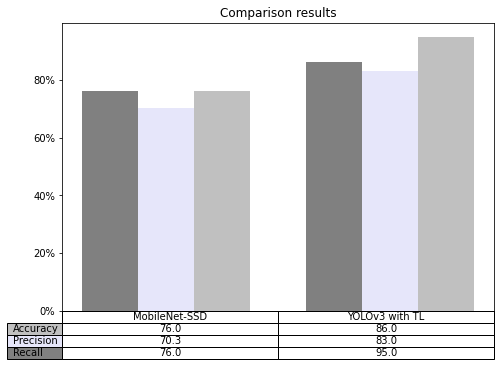
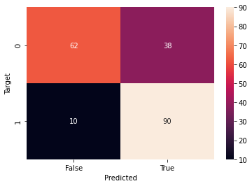

# Social distance detector

> Universidad Católica Boliviana "San Pablo" Regional La Paz Av 14 de Septiembre Nº 4807 esquina, La Paz - Bolivia

---
**Engineers developer team**  
---
<div style = "fonr-size:15px">
Bustillos Vila, Daniel Arturo
</div>
<div style = "fonr-size:15px">
Fernandez Testa, Sergio Rodrigo
</div>
<div style = "fonr-size:15px">
Molina Montes, Mariana
</div>
<div style = "fonr-size:15px">
Quinteros Terrazas, Osvaldo Cesar
</div>
<br>

> Mechatronics Engineering La Paz, Bolivia

## Introduction
COVID-19 belongs to the family of diseases caused by coronavirus, first reported in China in late 2019. China announced its first death from the virus on January 11, 2020, a 61-year-old man. On March 11th,The World Health Organization (WHO) declared this disease a pandemic due to its rapid spread in 114 countries with high mortality and high active cases. Several health organizations, scientists, and doctors tried to develop a vaccine, but until then there was no success.


This forced the world to look for an alternative solution to avoid drastic results. The lockdown was imposed globally and maintaining a safe social distance is reported to be the alternative solution to deal with this drastic situation. The term social distancing is the best idea to minimize the spread of COVID-19. The basic goal is to reduce physical contact between the infected and healthy people. As prescribed by the WHO, people should keep a distance of at least 1 meter from each other to control the spread of this disease.
One idea to monitor social distancing in public places is to use some method of machine vision with security cameras. While this does not help us to force people to maintain adequate social distance, it helps us to plan new security measures.
Since it has been shown that there is a relationship between the spread with respect to the social behavior of people, a place that could require attention is the work sectors with attention to the public, places of supply such as the market or supermarket, or places of entertainment such as the beach or cinemas.

## Problem statement

Currently, a very complicated situation that has been affecting the world population since the end of the year 2019 is the coronavirus. The coronavirus has changed the way of life of the entire population and has forced us to take certain measures to avoid contagion. Among the measures that one should consider to avoid catching the virus is social distancing, because the virus is spread among people and through the air. Today, in the year 2021, we are facing an even worse threat than in past years, due to a resurgence and mutation of the virus in countries such as India, England and Brazil. However, biosecurity measures remain the same as they were with the first strain, including the use of a chapstick, avoidance of enclosed and/or crowded spaces and social distancing. Consequently, this project has application in public places, since it allows us to determine how many people in an established area are complying with biosecurity measures. +drama
The team is going to use Coco dataset in order to train the model efficiently and in this way solve this problem. Coco is a dataset that has labeled images of people, cars, trucks, airplanes, animals, etc. In a punctual way, The following data can be found
- Whether the object is in the image or not.
- The size that is required for the detection box
- To which class it belongs, in this case we are interested in the class "people".
The team expects to use this data to be able to alert when people are too close together and in this way, reduce contagion. Development of the algorithm logic is based on numerical values indicating how many people in the image would be breaching the social distance. 
Finally, a test set will be prepared with a prudent number of images that will give us as a result significant metrics, being the evaluation metrics used:
- Accuracy
- Confusion matrix 
- Recall


The best way to fight the spread of the virus is to stay at home, nonetheless when this is not possible the best way in which we can take care of ourselves is by social distancing from each other. Everyone has a crucial role to play in slowing the spread and protecting themselves, their family, and their community, protecting all bolivians. In addition to practicing everyday steps to prevent COVID-19 such as, wearing masks, avoiding touching your face with unwashed hands, and frequently washing your hands with soap and water, keeping space between you and others is one of the best tools we have to avoid being exposed to this virus and slowing its spread. 

```python
# Upload model
from google.colab import files
uploaded = files.upload()
```


<input type="file" id="files-2ce4615e-538f-4cd6-9c98-27b43fbd2365" name="files[]" multiple disabled
   style="border:none" />
<output id="result-2ce4615e-538f-4cd6-9c98-27b43fbd2365">
 Upload widget is only available when the cell has been executed in the
 current browser session. Please rerun this cell to enable.
 </output>
 <script src="/nbextensions/google.colab/files.js"></script> 


```python
!unzip -qq necessary_files.zip
%cd necessary_files
```

    --2021-06-11 13:40:21--  https://s3-us-west-2.amazonaws.com/static.pyimagesearch.com/real-time-object-detection-deep-learning/real-time-object-detection.zip
    Resolving s3-us-west-2.amazonaws.com (s3-us-west-2.amazonaws.com)... 52.218.197.8
    Connecting to s3-us-west-2.amazonaws.com (s3-us-west-2.amazonaws.com)|52.218.197.8|:443... connected.
    HTTP request sent, awaiting response... 200 OK
    Length: 21376463 (20M) [application/zip]
    Saving to: ‘real-time-object-detection.zip’
    
    real-time-object-de 100%[===================>]  20.39M  16.2MB/s    in 1.3s    
    
    2021-06-11 13:40:22 (16.2 MB/s) - ‘real-time-object-detection.zip’ saved [21376463/21376463]
    
    /content/real-time-object-detection


```python
from google.colab import files
uploaded = files.upload()
```


<input type="file" id="files-98ee018b-c8e6-4ed5-9dc7-7c08cd57fc6b" name="files[]" multiple disabled
   style="border:none" />
<output id="result-98ee018b-c8e6-4ed5-9dc7-7c08cd57fc6b">
 Upload widget is only available when the cell has been executed in the
 current browser session. Please rerun this cell to enable.
 </output>
 <script src="/nbextensions/google.colab/files.js"></script> 


### Import Packages


```python
# import the necessary packages
from matplotlib import pyplot as plt
from imutils.video import FPS
import numpy as np
import argparse
import imutils
import cv2
```

### Function to display images in Jupyter Notebooks and Google Colab


```python
def plt_imshow(title, image):
	# convert the image frame BGR to RGB color space and display it
	image = cv2.cvtColor(image, cv2.COLOR_BGR2RGB)
	plt.imshow(image)
	plt.title(title)
	plt.grid(False)
	plt.show()
```

### Object detection in video with deep learning and OpenCV


```python
# first, let's get a video on which we can run our face mask detector 
!wget https://colab-notebook-videos.s3-us-west-2.amazonaws.com/janie.mp4
```

    --2021-06-11 13:40:59--  https://colab-notebook-videos.s3-us-west-2.amazonaws.com/janie.mp4
    Resolving colab-notebook-videos.s3-us-west-2.amazonaws.com (colab-notebook-videos.s3-us-west-2.amazonaws.com)... 52.218.224.57
    Connecting to colab-notebook-videos.s3-us-west-2.amazonaws.com (colab-notebook-videos.s3-us-west-2.amazonaws.com)|52.218.224.57|:443... connected.
    HTTP request sent, awaiting response... 200 OK
    Length: 3413203 (3.3M) [video/mp4]
    Saving to: ‘janie.mp4’
    
    janie.mp4           100%[===================>]   3.25M  5.48MB/s    in 0.6s    
    
    2021-06-11 13:41:00 (5.48 MB/s) - ‘janie.mp4’ saved [3413203/3413203]
    


```python
#@markdown # Declaration of initial parameters
#@markdown * Input video
#@markdown * Output video
#@markdown * probability for model
#@markdown * Model
#@markdown * Confidence
args = {
	"input" : "Subway.mp4",
	"output" : "output.avi",
	"prototxt": "MobileNetSSD_deploy.prototxt.txt",
	"model": "MobileNetSSD_deploy.caffemodel",
	"confidence" : 0.5
}
```


```python

CLASSES = ["background", "aeroplane", "bicycle", "bird", "boat",
	"bottle", "bus", "car", "cat", "chair", "cow", "diningtable",
	"dog", "horse", "motorbike", "person", "pottedplant", "sheep",
	"sofa", "train", "tvmonitor"]
COLORS = np.random.uniform(0, 255, size=(len(CLASSES), 3))

# load our serialized model from disk
print("[INFO] loading model...")
net = cv2.dnn.readNetFromCaffe(args["prototxt"], args["model"])
```

    [INFO] loading model...


```python
# grab a reference to the video file, initialize pointer to output
# video file, and initialize the FPS counter
print("[INFO] opening video file...")
vs = cv2.VideoCapture(args["input"])
writer = None
fps = FPS().start()
```

    [INFO] opening video file...


## Helpers

### Classes


```python
#Define rectangle based on two dots
class rectangle:
    def __init__(self, x1, y1, x2, y2):
        self.x1 = x1
        self.y1 = y1
        self.x2 = x2
        self.y2 = y2
      
    def coordinates(self):
      return self.x1, self.y1, self.x2, self.y2
```

### Functions


```python
#Define if 2 rectangles are overlaped
def overlap(r1, r2):
    #Verifing first rectangle dots
    if (r1.x2>=r2.x1 and r1.x2 <=r2.x2 and r1.y2>=r2.y1 and r1.y2 <=r2.y2):
      return True
    if (r1.x1>=r2.x1 and r1.x1 <=r2.x2 and r1.y1>=r2.y1 and r1.y1 <=r2.y2):
      return True
    if (r1.x2>=r2.x1 and r1.x2 <=r2.x2 and r1.y1>=r2.y1 and r1.y1 <=r2.y2):
      return True
    if (r1.x1>=r2.x1 and r1.x1 <=r2.x2 and r1.y2>=r2.y1 and r1.y2 <=r2.y2):
      return True
    
    #Verifing second rectangle dots
    if (r2.x2>=r1.x1 and r2.x2 <=r1.x2 and r2.y2>=r1.y1 and r2.y2 <=r1.y2):
      return True
    if (r2.x1>=r1.x1 and r2.x1 <=r1.x2 and r2.y1>=r1.y1 and r2.y1 <=r1.y2):
      return True
    if (r2.x2>=r1.x1 and r2.x2 <=r1.x2 and r2.y1>=r1.y1 and r2.y1 <=r1.y2):
      return True
    if (r2.x1>=r1.x1 and r2.x1 <=r1.x2 and r2.y2>=r1.y1 and r2.y2 <=r1.y2):
      return True
    return False

#Count overlaped rectangles
def count_cases(rectangles):
    overlaped = 0
    for i in range(1,len(rectangles)):
        for j in range(1,len(rectangles)):
            if overlap(rectangles[0],rectangles[j]):
                overlaped +=1
                break
        rectangles.pop(0)    

    return overlaped

```

## Predict image


```python
def prediction(frame):
    # resize the frame to have a maximum width of 400 pixels
    frame = imutils.resize(frame, width=400)

    # grab the frame dimensions and convert it to a blob
    (h, w) = frame.shape[:2]
    blob = cv2.dnn.blobFromImage(frame, 0.007843, (300, 300), 127.5)

    # pass the blob through the network and obtain the detections and
    # predictions
    net.setInput(blob)
    detections = net.forward()
    rectangles = []
  

     # loop over the detections
    for i in np.arange(0, detections.shape[2]):
        # extract the confidence (i.e., probability) associated with
        # the prediction
        confidence = detections[0, 0, i, 2]

        # filter out weak detections by ensuring the `confidence` is
        # greater than the minimum confidence
        if confidence > args["confidence"]:
            # extract the index of the class label from the
            # `detections`, then compute the (x, y)-coordinates of
            # the bounding box for the object
            idx = int(detections[0, 0, i, 1])
            box = detections[0, 0, i, 3:7] * np.array([w, h, w, h])
            (startX,startY,endX,endY) = box.astype("int")
            rectangles.append(rectangle(startX,startY,endX,endY))
            # draw the prediction on the frame
            label = "{}: {:.2f}%".format(CLASSES[idx],
                confidence * 100)
            cv2.rectangle(frame,(startX, startY), (endX, endY), COLORS[idx], 2)
            y = startY - 15 if startY - 15 > 15 else startY + 15
        #Variables used for add rectangles to $total_rectangles    
        aux = []
        for i,j in enumerate(rectangles):
            aux.append(j)

    overlaped = count_cases(rectangles)
    return bool(overlaped)
```


```python
#Define the image to predict
image = cv2.imread("/content/overlap.jpeg")
print(image.shape)
  
```

    (392, 640, 3)


```python
#to predict the case of the image
prediction(image)
!pwd
```

    /content/real-time-object-detection


##Evaluation Metrics


```python
#unzip the dataset_validation
!unzip -qq /content/overlaped.zip
!unzip -qq /content/non_overlaped.zip
```


```python
import pandas as pd
from sklearn import metrics
import seaborn as sn
df = pd.read_csv('/content/dataset.csv')
df['y_pred'] = [prediction(x) for x in [cv2.imread(y) for y in df['filename']]]
df
```


<div>
<style scoped>
    .dataframe tbody tr th:only-of-type {
        vertical-align: middle;
    }

    .dataframe tbody tr th {
        vertical-align: top;
    }

    .dataframe thead th {
        text-align: right;
    }
</style>
<table border="1" class="dataframe">
  <thead>
    <tr style="text-align: right;">
      <th></th>
      <th>filename</th>
      <th>y_test</th>
      <th>y_pred</th>
    </tr>
  </thead>
  <tbody>
    <tr>
      <th>0</th>
      <td>/content/non_overlaped/img_0001.jpg</td>
      <td>0</td>
      <td>True</td>
    </tr>
    <tr>
      <th>1</th>
      <td>/content/non_overlaped/img_0002.jpg</td>
      <td>0</td>
      <td>False</td>
    </tr>
    <tr>
      <th>2</th>
      <td>/content/non_overlaped/img_0003.jpg</td>
      <td>0</td>
      <td>True</td>
    </tr>
    <tr>
      <th>3</th>
      <td>/content/non_overlaped/img_0004.jpg</td>
      <td>0</td>
      <td>False</td>
    </tr>
    <tr>
      <th>4</th>
      <td>/content/non_overlaped/img_0005.jpg</td>
      <td>0</td>
      <td>True</td>
    </tr>
    <tr>
      <th>...</th>
      <td>...</td>
      <td>...</td>
      <td>...</td>
    </tr>
    <tr>
      <th>195</th>
      <td>/content/overlaped/img_0096.jpg</td>
      <td>1</td>
      <td>True</td>
    </tr>
    <tr>
      <th>196</th>
      <td>/content/overlaped/img_0097.jpg</td>
      <td>1</td>
      <td>True</td>
    </tr>
    <tr>
      <th>197</th>
      <td>/content/overlaped/img_0098.jpg</td>
      <td>1</td>
      <td>True</td>
    </tr>
    <tr>
      <th>198</th>
      <td>/content/overlaped/img_0099.jpg</td>
      <td>1</td>
      <td>True</td>
    </tr>
    <tr>
      <th>199</th>
      <td>/content/overlaped/img_0100.jpg</td>
      <td>1</td>
      <td>True</td>
    </tr>
  </tbody>
</table>
<p>200 rows × 3 columns</p>
</div>


```python
print("Accuracy: ",metrics.accuracy_score(df["y_test"], df["y_pred"]))
print("Precision: ",metrics.precision_score(df["y_test"], df["y_pred"]))
print("Recall: ", metrics.recall_score(df["y_test"], df["y_pred"], average='weighted'))
Accuracy = metrics.accuracy_score(df["y_test"], df["y_pred"])*100
Precision = metrics.precision_score(df["y_test"], df["y_pred"])*100
Recall = metrics.recall_score(df["y_test"], df["y_pred"], average='weighted')*100
```

    Accuracy:  0.76
    Precision:  0.703125
    Recall:  0.76


```python
import numpy as np
import matplotlib.pyplot as plt
datap = [[Accuracy, 86],
[Precision, 83],
[Recall, 95]]

columns = ('MobileNet-SSD', 'YOLOv3 with TL')
rows = ['Accuracy', 'Precision', 'Recall']

data = [            ['MobileNet-SSD', 'YOLOv3 with TL'],
        ['Accuracy', Accuracy, 86],
        ['Precision', Precision, 83],
        ['Recall', Recall, 95]
]

column_headers = data.pop(0)
row_headers = [x.pop(0) for x in data]

cell_text = []
for row in data:
    cell_text.append([f'{x:1.1f}' for x in row])

X = np.arange(2)
fig = plt.figure()
ax = fig.add_axes([0,0,1,1])
ax.bar(X + 0.00, datap[0], color = '#808080', width = 0.25)
ax.bar(X + 0.25, datap[1], color = '#e6e6fa', width = 0.25)
ax.bar(X + 0.50, datap[2], color = '#c0c0c0', width = 0.25)

ax.set_title('Comparison results')
ax.set_yticks([0,20,40,60,80])
yticks = ['0%', '20%', '40%', '60%', '80%']
ax.set_yticklabels(yticks)
ax.get_xaxis().set_visible(False)
colors = ['#808080', '#e6e6fa', '#c0c0c0']
colors = colors[::-1]
the_table = plt.table(cellText=cell_text,
                      cellLoc='center',
                      rowLabels=row_headers,
                      rowColours=colors,
                      colLabels=column_headers,
                      loc='bottom')
plt.savefig('table.eps', format='eps', bbox_inches = 'tight')
```


    

    


```python
confusion_matrix = pd.crosstab(df["y_test"], df["y_pred"], rownames=['Target'], colnames=['Predicted'])
sn.heatmap(confusion_matrix, annot=True)
plt.savefig('figure.eps', format='eps')
```


    

    


```python
average = "weighted" #@param ["macro", "micro", "weighted"]


print("F1 score: ",metrics.f1_score(df["y_test"], df["y_pred"], average=average))
```

    F1 score:  0.7552019583843329


```python
print(metrics.recall_score(df["y_test"], df["y_pred"], average='macro'))
print(metrics.recall_score(df["y_test"], df["y_pred"], average='micro'))
print(metrics.recall_score(df["y_test"], df["y_pred"], average='weighted'))
```

    0.76
    0.76
    0.76


```python
print(metrics.classification_report(df["y_test"], df["y_pred"]))
```

                  precision    recall  f1-score   support
    
               0       0.86      0.62      0.72       100
               1       0.70      0.90      0.79       100
    
        accuracy                           0.76       200
       macro avg       0.78      0.76      0.76       200
    weighted avg       0.78      0.76      0.76       200
    

